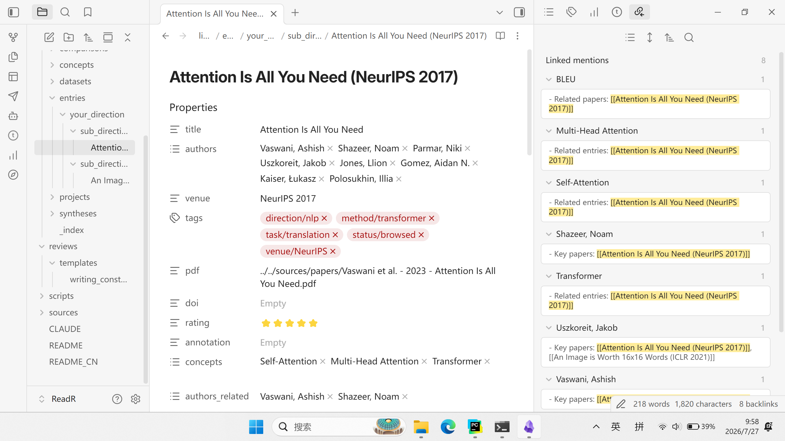
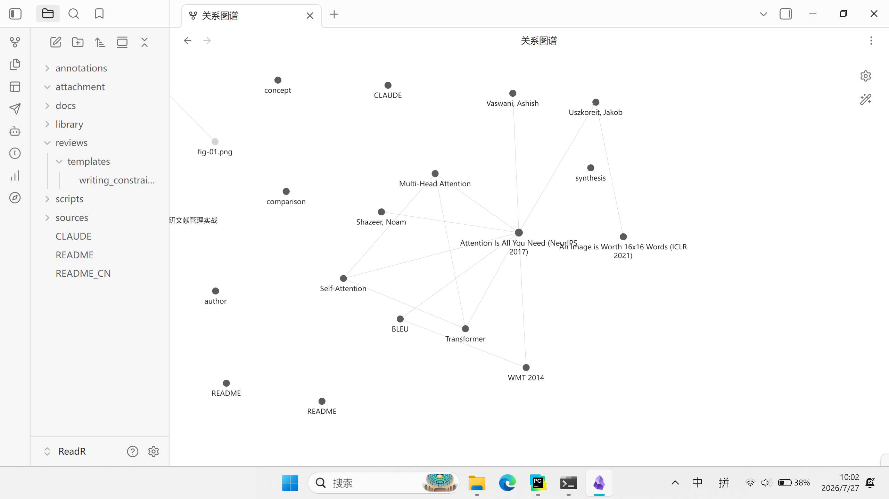
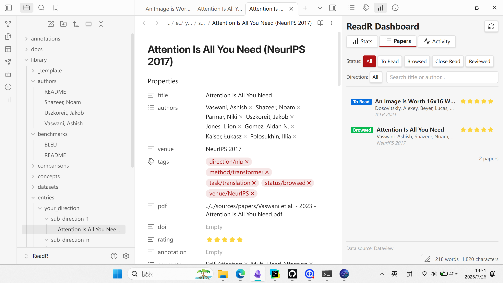
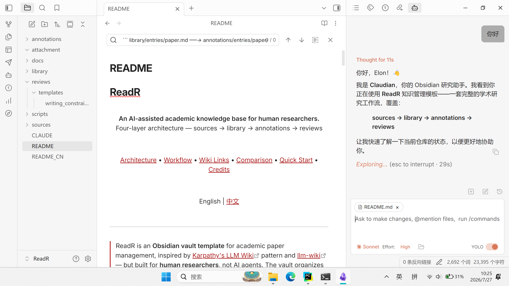
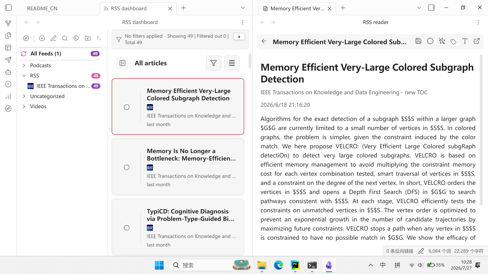

# ReadR

<p align="center">
  
  <br>
  <strong>为人类研究者设计的 AI 辅助学术知识库</strong><br>
  sources → library → annotations → reviews
</p>

<p align="center">
  <a href="#架构">架构</a> •
  <a href="#工作流">工作流</a> •
  <a href="#与-llm-wiki-对比">对比</a> •
  <a href="#快速开始">快速开始</a> •
  <a href="#致谢">致谢</a>
</p>
<p align="center">
  <a href="#obsidian-使用指南">Obsidian</a> •
  <a href="#claude-code-使用指南">Claude</a> •
  <a href="#notebooklm-集成可选">NotebookLM</a> •
  <a href="#rss-订阅源供计算机专业使用">RSS</a> •
  <a href="#专栏系列">专栏</a>
</p>

<p align="center">
  <a href="README.md">English</a> | 中文
</p>

---

> ReadR 是一个面向**学术论文管理**的 **Obsidian 模板库**，灵感来自 [Karpathy's LLM Wiki](https://gist.github.com/karpathy/442a6bf555914893e9891c11519de94f) 的范式与 [llm-wiki](https://github.com/nashsu/llm_wiki) 项目——但它的设计服务于**人类研究者**，而非 AI 智能体。该库将论文的全生命周期组织为清晰的四层结构，AI 是可选助手，而不是主要作者。


## 架构

```
┌──────────────────────────────────────────────────────────┐
│                     SCHEMA LAYER                         │
│          CLAUDE.md — 操作规则、命名约定、工作流              │
├─────────────┬─────────────┬───────────────┬──────────────┤
│             │             │               │              │
│  sources/   │  library/   │ annotations/  │   reviews/   │
│  原始素材    │  论文目录    │  精读笔记       │   综述论文    │
│  (只读)      │ + 知识提炼   │               │   (产出)     │
│             │             │               │              │
│  不可变      │  你整理      │  你撰写        │  你写作      │
│             │             │               │              │
└─────────────┴─────────────┴───────────────┴──────────────┘
       ↑             ↑              ↑
       └─────────────┴──────────────┘
              wiki-link 互联
```

### 设计原则

- **sources 不可变** — PDF 和剪藏一旦放入，永不修改
- **一份源，一条目** — 每篇论文在 library/entries/ 中只有一个条目
- **精读后才写 annotation** — annotations/ 是精读产物，不是浏览笔记
- **知识沉淀伴随浏览** — concepts/ authors/ datasets/ 等是浏览时同步完成的提炼
- **synthesis 桥接 review** — syntheses/ 是从"读论文"到"写综述"的中间态

### 目录结构

```
├── sources/                        原始素材（只读）
│   ├── papers/                     学术论文 PDF
│   ├── web/                        网页文章、博客
│   ├── books/                      书籍/专著章节
│   ├── talks/                      讲座、课程
│   └── misc/                       其他
│
├── library/                        论文目录 + 知识提炼
│   ├── _template/                  条目模板
│   ├── entries/                    论文条目（按研究方向）
│   │   ├── nlp/                    示例：自然语言处理
│   │   ├── cv/                     示例：计算机视觉
│   │   └── your_direction/         替换为你的方向
│   ├── concepts/                   核心概念
│   ├── authors/                    研究者
│   ├── datasets/                   数据集
│   ├── benchmarks/                 评测基准
│   ├── comparisons/                方法对比
│   ├── syntheses/                  综合概述
│   └── projects/                   在研项目
│
├── annotations/                    精读笔记
│   ├── _template/                  精读笔记模板
│   ├── cv/                          CV 论文笔记
│   ├── nlp/                         NLP 论文笔记
│   └── your_direction/             替换为你的方向
│
├── reviews/                        综述论文
│   └── templates/                  文献综述模板
│
├── docs/                           项目文档
│   ├── column/                     ReadR 专栏系列
│   └── *                           其它
│
├── scripts/                        自动化工具
│
├── CLAUDE.md                       AI 辅助契约
└── .gitignore
```

### 四层详解

#### sources/ — 原始素材层（只读）

**规则：** 只读。AI 不可修改。存放所有原始材料。

这是论文的"档案馆"——所有 PDF、网页剪藏、书籍章节等原始材料一经放入，永不修改。配合 RSS Dashboard 插件可自动拉取最新论文，导入后也可推送到 NotebookLM 做进一步分析（见后文）。

```
sources/
├── papers/         ← 学术论文 PDF
├── web/            ← 网页文章、博客
├── books/          ← 书籍章节
├── talks/          ← 讲座、课程
└── misc/           ← 其他
```

#### library/ — 粗读层（知识蒸馏）

这是论文的"图书馆"——每篇论文在 `entries/` 中对应一个 markdown 条目，同时浏览时沉淀的知识写入独立子目录，通过 wiki-link 相互关联。

```
library/
├── _index.md                          ← 总索引（自动生成）
├── _template/                         ← 条目模板
│   ├── library-entry.md              论文条目
│   ├── concept.md                    概念笔记
│   ├── author.md                     研究者档案
│   ├── dataset.md                    数据集
│   ├── benchmark.md                  评测基准
│   ├── comparison.md                 方法对比
│   ├── synthesis.md                  综合概述
│   └── project.md                    项目进度
├── entries/                             ← 论文条目（按研究方向分目录）
│   ├── nlp/                             示例：自然语言处理
│   ├── cv/                              示例：计算机视觉
│   └── your_direction/                  替换为你的方向
├── concepts/                          ← 核心概念
├── authors/                           ← 研究者档案
├── datasets/                          ← 数据集描述
├── benchmarks/                        ← 评测基准
├── comparisons/                       ← 方法对比
├── syntheses/                         ← 综合概述（3+ 篇后撰写）
└── projects/                          ← 在研项目
```

#### annotations/ — 精读层

**规则：** 只有 `status: close-read` 的论文才创建精读笔记。每篇论文一个文件夹。

这是论文的"读书笔记"——逐行精读后，将论文的论证逻辑、实验设计、公式推导、图表含义等以结构化笔记形式记录。

```
annotations/
├── _template/                         ← 精读笔记模板
│   └── reading-note.md                ← 图/表/公式嵌入规范
├── cv/                                 ← CV 论文笔记（同 library 子方向）
├── nlp/                                ← NLP 论文笔记
└── your_direction/                     ← 替换为你的方向
```

#### reviews/ — 综述层

**这是整个工作流的最终产出。** 汇总子方向内所有论文，结合 `concepts/`、`syntheses/`、`comparisons/` 中的知识，撰写正式综述论文。

```
reviews/
├──  templates/                        ← 综述模板
│   └── writing_constraints_template.md  ← 写作约束
└── your_survey/                       ← 你的综述文章
```

#### docs/ — 项目文档

存放支撑 vault 方法论的辅助文档，包括专栏系列、文献综述论文等。

```
docs/
├── column/                             ← "四层架构"专栏系列（中文）
│   ├── 00-开篇词-为什么你的文献库读完就是坟场.md    ← 痛点分析
│   ├── 01-四层架构-给论文管理设计一套读写权限.md    ← 四层权限设计
│   ├── 02-元数据设计-YAML与wiki-link拓扑.md       ← 元数据与链接
│   ├── 03-人机分工-AI能做什么不能做什么.md         ← 人机分工边界
│   ├── 04-知识沉淀的最小动作-从浏览到精读.md        ← 最小知识沉淀
│   ├── 05-工具化-封装成可复用的AgentSkill.md       ← 工具化封装
│   ├── 加餐-.md
│   ├── 加餐-ReadR三次迭代都做了什么.md
│   └── 专栏细纲-AI时代的科研文献管理实战.md         ← 专栏大纲
└── images/                             ← 专栏配图
```

#### scripts/ — 自动化工具

```
scripts/
└── ReadR.ps1                           ← 校验（-Validate）与索引更新（-UpdateIndex）
```

---

## 工作流

```
sources/     library/      annotations/    reviews/
  │             │              │              │
  ▼             ▼              ▼              ▼
┌──────┐   ┌──────────┐   ┌─────────┐   ┌──────────┐
│INgest│──▶│  Browse  │──▶│CloseRead│──▶│  Review   │
│ 入库  │   │ 浏览/粗读 │   │  精读   │   │ 文献综述  │
└──────┘   └─────┬────┘   └─────────┘   └──────────┘
                 │
                 ▼
             concepts/         ← 浏览时同步沉淀
             authors/
             datasets/
             benchmarks/
             comparisons/
             syntheses/        ← 子方向积累 3+ 篇后写
             projects/
```

**核心原则：** 一篇论文的完整生命周期，严格按阶段推进，不可跳跃。每阶段有明确的输入、动作和产出。

---

### 1️⃣ INGEST — 入库

**输入：** 一篇想读的论文（可使用 obsidian 插件通过 RSS 源导入）

**动作：**
1. 下载论文 PDF，放入 `sources/papers/`
2. 在 `library/entries/` 对应子方向创建论文条目，可参考 `library/_template/` 模板
3. 填写 YAML frontmatter（标题、作者、venue、DOI、标签），设置 `status: to-read`
4. （可选）同步导入 NotebookLM，便于后续 AI 辅助分析

**产出：** `sources/papers/` 中有 PDF，`library/entries/` 中有条目，状态为 `to-read`

---

### 2️⃣ BROWSE — 浏览/粗读（含知识沉淀）

浏览论文的同时，将获取的知识沉淀到 library 的各个子目录中。

**动作：**
1. 阅读标题、摘要、引言、结论
2. 在论文条目中补充概要（summary），打标签，设置 `status: browsed`
3. **同步沉淀知识**到以下子目录，通过 wiki-link 与条目关联：

   | 知识类型 | 沉淀位置 | 说明 |
   |---------|---------|------|
   | 核心概念 | `library/concepts/` | 定义、解释、与已有概念的关系 |
   | 研究者 | `library/authors/` | 姓名、机构、研究方向、代表作 |
   | 数据集 | `library/datasets/` | 名称、规模、来源、用途 |
   | 评测基准 | `library/benchmarks/` | 指标、对比方法、结果 |
   | 同类方法 | `library/comparisons/` | 对比表格，多篇论文积累后补充 |
   | 综合概述 | `library/syntheses/` | 同一子方向 3+ 篇论文后撰写 |
   | 项目关联 | `library/projects/` | 标记对当前在研项目的参考价值 |

> **AI 可辅助：** 提取概念、研究者、数据集、基准；生成方法对比表格；撰写综合概述初稿。

**产出：** 论文条目状态为 `browsed`，相关知识点已写入 `concepts/`、`authors/`、`datasets/`、`benchmarks/` 等

---

### 3️⃣ CLOSE-READ — 精读

**输入：** 一篇已浏览（`status: browsed`）且值得精读的论文

**动作：**
1. 在 `annotations/` 对应子方向下创建论文精读文件夹
2. 参照 `annotations/_template/reading-note.md` 模板撰写精读笔记，包含：
   - 研究动机与问题定义
   - 方法细节（含公式推导）
   - 实验设置与结果分析（含图表解读）
   - 核心结论与局限
   - 个人评价与反思
1. 更新 library 条目中的 `annotation:` 字段，指向精读笔记路径
2. 设置 `status: close-read`

> **AI 可辅助：** 按模板生成精读笔记初稿，但图/表/公式的嵌入解释需要人工处理。

**产出：** `annotations/` 下有精读笔记，论文条目状态为 `close-read`

---

### 4️⃣ REVIEW — 文献综述

**输入：** 同一子方向已积累多篇论文（含浏览和精读）

**动作：**
1. 查阅 `concepts/`、`syntheses/`、`comparisons/` 中的沉淀知识
2. 在 `reviews/` 下创建综述文件夹，规划大纲
3. 整合所有论文，撰写正式综述

> **AI 可辅助：** 使用 NotebookLM 生成报告草稿（`notebooklm generate report`），下载为 Markdown 后人工精修。

**产出：** `reviews/` 下的综述论文（survey.md / survey.pdf / survey.tex）

---
```
library/entries/paper.md ──→ annotations/paper/index.md
         │                          │
         ├──→ library/concepts/     │
         ├──→ library/authors/      │
         ├──→ library/datasets/     │
         ├──→ library/benchmarks/   │
         └──→ library/comparisons/  │
                                    │
                ┌───────────────────┘
                ▼
         reviews/review.md ──→ library/syntheses/
```

- **论文条目 → 概念/作者/数据/基准/对比**：一篇论文关联多个知识节点
- **概念 ↔ 作者**：谁提出了这个概念？双向链接
- **精读笔记 → 论文条目**：精读是条目的深化，通过 `annotation:` 字段关联
- **综述 → 综合**：综述引用 syntheses/，syntheses/ 引用 entries/
---

## 与 llm-wiki 对比

| 维度       | llm-wiki (Karpathy)       | ReadR                                         |     |
| -------- | ------------------------- | --------------------------------------------- | --- |
| **目标用户** | AI Agent（人审核）             | 人类研究者（AI 辅助）                                  |     |
| **知识单元** | 文章、视频、笔记、文档               | 学术论文（主要）                                      |     |
| **层架构**  | raw/ → wiki/ → schema     | sources/ → library/ + annotations/ → reviews/ |     |
| **不可变层** | raw/（全文/视频/笔记）            | sources/（PDF/剪藏）                              |     |
| **知识层**  | wiki/（AI 维护的概念/实体/综合）     | library/（人整理的条目/概念/实体）                        |     |
| **精读层**  | 无（wiki/sources 包含摘要）      | annotations/（独立精读笔记）                          |     |
| **产出层**  | 无（wiki 本身就是产出）            | reviews/（可发表的综述）                              |     |
| **主要作者** | AI Agent                  | 人类                                            |     |
| **状态管理** | active / stale / archived | to-read / browsed / close-read                |     |
| **元数据**  | 通用 frontmatter            | 学术专用（作者/venue/DOI/rating）                     |     |
| **合成机制** | AI 自动更新 overviews         | 人手写 syntheses/ → reviews/                     |     |
| **最终目标** | 知识积累（wiki 即终点）            | 知识积累 → 综述产出                                   |     |

### 核心设计差异

llm-wiki 把 LLM 定位为"知识编译器"——你投喂原料，AI 自动维护 wiki。它的创新在于将 LLM 从"每次重新检索"变成了"增量编译"，知识随时间复利增长。

ReadR 把**人**放在中心。AI 是助手，不是主人。差异体现在：

1. **精读层** — llm-wiki 没有对应物。机器可以总结，但论文的公式推导、实验分析、消融研究需要人逐行读、逐行写
2. **综述层** — llm-wiki 的 wiki 本身就是终点。科研的终点是可发表的 survey，需要人整合几十篇论文形成观点
3. **实体拆分** — llm-wiki 用 entities/ 统一装人物/组织/产品。科研场景下 researchers / datasets / benchmarks 是三类独立实体，各自有不同的查询维度

### 借鉴的设计

- **层分离** — sources/（不可变）与 library/（你的理解）严格分开
- **增量编译** — 每篇论文仅浏览一次，概念/实体/对比持续累积
- **wiki-link 拓扑** — concepts/ ↔ authors/ ↔ comparisons/ 双向链接
- **CLAUDE.md 契约** — 编码所有规则让 AI 行为一致
- **约定大于配置** — YAML schema、标签体系、命名规范

---

## 快速开始

### 前置要求

- [Obsidian](https://obsidian.md/) 或任何 Markdown 编辑器
- （可选）[Claude Code](https://claude.ai/code) 用于 AI 辅助
- （可选）[NotebookLM](https://notebooklm.google.com/) 用于 AI 分析（参见 [NotebookLM 集成](#notebooklm-集成)）

### 三步上手

**第一步：克隆并打开 vault**

```bash
git clone https://github.com/elonwoo-02/ReadR.git
cd ReadR
# 打开 Obsidian → "Open folder as vault" → 选择 ReadR/
```

**第二步：完成第一篇论文的完整生命周期**

```bash
# 1. INGEST — 放入 PDF，创建条目
cp sources/papers/example.pdf library/entries/your-direction/
cp library/_template/library-entry.md library/entries/your-direction/我的论文.md
# 编辑 YAML 中的 title/authors/venue/tags，设置 status: to-read

# 2. BROWSE — 阅读摘要，沉淀知识
# 在条目中写 summary，打开 concepts/authors/datasets/ 目录创建对应笔记
# 设置 status: browsed

# 3. CLOSE-READ — 精读（可选）
# 在 annotations/your-direction/ 下创建精读笔记文件夹
# 设置 status: close-read

# 4. REVIEW — 撰写综述（积累 3+ 篇后）
# 在 reviews/ 下创建综述文件夹开始写作
```

**第三步：启用插件**

打开 Obsidian → **设置 → 第三方插件**，启用五个预装插件（详见 [Obsidian 使用指南 → 内置插件](#内置插件)）。

```bash
# ReadR Dashboard 需要额外构建
cd .obsidian/plugins/readr-dashboard/
npm install && npm run build
```

### 日常维护

```bash
# 校验 vault 完整性（检查 YAML、必填字段、wiki-link）
pwsh scripts/ReadR.ps1 -Validate

# 自动生成 library 总索引
pwsh scripts/ReadR.ps1 -UpdateIndex
```

### AI 辅助（可选）

ReadR 的 `CLAUDE.md` 已配置完整的项目结构和规则，AI 工具会自动遵循。配合 Claude Code 或 NotebookLM 可在以下环节加速：

| 环节 | AI 可协助的内容 |
|------|---------------|
| **BROWSE** — 知识沉淀 | 提取概念、研究者、数据集、基准；生成方法对比表格；撰写综合概述初稿 |
| **CLOSE-READ** — 精读笔记 | 按模板生成精读笔记初稿（图/表/公式需人工处理） |
| **REVIEW** — 综述写作 | 使用 NotebookLM 生成报告草稿，下载为 Markdown 后人工精修 |

---
## 操作指南

### Obsidian 使用指南

#### 面板布局推荐

```
┌──────────────────────────────────────────────┐
│  左侧边栏         │  编辑区     │ 右侧边栏     │
│                    │            │              │
│  ├ 文件列表        │  正在编辑   │  ├ Backlinks │
│  ├ 收藏夹          │  的笔记     │  ├ 大纲      │
│  └ (可折叠)        │            │  └ 图谱      │
│                    │            │              │
└──────────────────────────────────────────────┘
```

- **左侧边栏**：文件列表（按四层目录结构浏览）、收藏夹（常用目录）
- **右侧边栏**：Backlinks 面板查看反向链接、大纲面板查看标题结构
- **标签页**：支持同时打开多个笔记，拖拽可拆分窗口

#### 在 Obsidian 中创建链接

Obsidian 使用 `[[wiki-link]]` 语法建立笔记间的双向链接，配合侧边栏 **Backlinks** 面板可实时查看哪些笔记引用了当前页面。

**常见操作：**

| 场景 | 操作 | 效果 |
|------|------|------|
| 论文条目引用概念 | 在条目的 YAML `concepts:` 字段中写入 `[[Self-Attention]]` | 条目标注引用了该概念，概念页的 Backlinks 会显示这篇论文 |
| 论文条目引用作者 | 在 YAML `authors_related:` 中写入 `[[Vaswani, Ashish]]` | 点击自动跳转到作者档案 |
| 论文条目引用数据集 | 在 YAML `datasets:` 中写入 `[[WMT 2014]]` | 数据集页自动列出使用它的论文 |
| 概念笔记链接作者 | 在概念正文中写入 `[[Vaswani, Ashish]]` | 建立"谁提出了这个概念"的双向关联 |
| 综述引用综合概述 | 在综述正文中写入 `[[Transformer 综合概述]]` | 一键跳转到对应的 synthesis 笔记 |
| 精读笔记链接论文条目 | 在精读笔记上方写入 `← 详见 [[Attention Is All You Need (NeurIPS 2017)]]` | 精读与条目互相关联 |

**快捷技巧：**
- 输入 `[[` 会弹出文件搜索框，按文件名补全
- 右侧边栏 反向链接 面板（在设置-->核心插件 开关）显示所有反向链接，点击即跳转
- 在 关系图谱 视图（在设置-->核心插件 开关）中可直观看到所有笔记的链接关系网络


---

#### 与 ReadR 配合的技巧

1. **新建论文条目**：在 `library/entries/` 对应子方向下 `Ctrl+N`，使用模板快速填充
2. **快速跳转**：在论文条目中 `[[` 引用概念/作者/数据集，一键跳转
3. **Backlinks 溯源**：在概念页右侧查看哪些论文引用了该概念
4. **图谱视图**：`Ctrl+G` 查看整个方向的论文-概念-作者网络
5. **模板调用**：通过命令面板或 Templater 插件快速插入模板内容

#### 内置插件 ⭐

ReadR 打包了 5 个 Obsidian 插件，位于 `.obsidian/plugins/`。打开 Obsidian → **设置 → 第三方插件** 启用。

| 插件 | 用途 | 开箱即用？ |
|------|------|-----------|
| 📊 **ReadR Dashboard** | 统计仪表盘：论文分布、阅读进度、知识缺口检测、活动追踪 | 需构建 |
| 📋 **Dataview** | 元数据查询引擎，仪表盘依赖它做数据聚合 | ✅ 是 |
| 🤖 **RealClaudian** | Obsidian 内集成 Claude AI，辅助笔记和知识提炼 | ✅ 是 |
| 💻 **OTerm** | 编辑器内嵌终端，运行脚本和 git 命令 | ✅ 是 |
| 📰 **RSS Dashboard** | 内嵌 RSS 阅读器，追踪学术论文动态 | ✅ 是 |

```bash
# ReadR Dashboard 需要额外构建
cd .obsidian/plugins/readr-dashboard/
npm install && npm run build
```

**插件使用建议：**
- **ReadR Dashboard**：日常查看阅读进度和统计概览，通过侧边栏图标或命令面板打开

- **Dataview**：自动运行，无需手动操作；仪表盘和其他查询依赖它
- **RealClaudian**：浏览时直接向 Claude 提问，辅助知识提取

- **OTerm**：内嵌在obsidian中的命令行工具，不必切换窗口（可直接在 Obsidian 中运行 `pwsh scripts/ReadR.ps1 -Validate`）
- **RSS Dashboard**：订阅 arXiv 和 IEEE RSS 源，新论文自动推送到 vault


---

### Claude Code 使用指南（可以替换其它agent）

#### 前置准备

```bash
# 1. 安装 Claude Code （自行安装配置）

# 2. 在项目目录中启动
cd ReadR
claude

# 3. CLAUDE.md 自动加载
# ReadR 的 CLAUDE.md 已配置完整规则，Claude 会自动遵循
```

#### 在 ReadR 中的典型用法

**INGEST 阶段 — 辅助创建论文条目**

```
"根据这篇论文的 PDF 创建条目，使用 library/_template/library-entry.md 模板"
→ Claude 读取 PDF，生成 YAML frontmatter 和摘要
```

**BROWSE 阶段 — 知识蒸馏**

```
"从这篇论文中提取核心概念，写入 library/concepts/"
"提取作者信息，写入 library/authors/"
"生成方法对比表格，写入 library/comparisons/"
→ Claude 自动填充对应模板
```

**CLOSE-READ 阶段 — 精读笔记初稿**

```
"按 annotations/_template/reading-note.md 模板，为这篇论文生成精读笔记初稿"
→ Claude 生成结构化笔记，图/表/公式位置留空待人工补充
```

**REVIEW 阶段 — 综述辅助**

```
"汇总这个子方向的所有论文，撰写综合概述"
→ Claude 查阅相关条目，生成 synthesis 初稿
```

#### 注意事项

- **sources/ 不可修改** — Claude 不会修改 sources/ 中的任何文件
- **所有修改需用户确认** — Claude 不会未经确认写入文件
- **AI 产出是初稿** — 概念定义、方法对比、精读笔记等均需人工审校
- **图/表/公式** — 精读笔记中的图表和公式需要人工嵌入，AI 无法自动处理

### NotebookLM 集成（可选）

ReadR 通过 [notebooklm-py](https://github.com/teng-lin/notebooklm-py) CLI 与 [Google NotebookLM](https://notebooklm.google.com/) 深度集成——提供对 NotebookLM 全部功能的编程式访问，包括 Web UI 未暴露的能力。

#### 快速开始（做一个组会分享PPT）

```bash
# 1. 安装 notebooklm-py
pip install "notebooklm-py[browser]"
playwright install chromium
notebooklm login

# 2. 创建笔记本，添加论文
notebooklm create "我的研究方向"
notebooklm use <notebook-id>
notebooklm source add path/to/paper.pdf

# 3. 生成幻灯片
notebooklm generate slide-deck "这篇论文的核心方法介绍" --wait
notebooklm download slide-deck <artifact-id>     # → PDF 或 PPTX
```

#### Claude Code 集成

NotebookLM skill 已预装到 Claude Code 中：

```bash
notebooklm skill install --scope user --target claude
```

安装后，可在 Claude Code 中通过 `/notebooklm` 或自然语言描述（如"把这篇论文做成播客"）直接调用 NotebookLM 命令。

#### 功能清单

| 分类 | 命令 | 功能 |
|------|------|------|
| **来源管理** | `source add` | 添加来源（URL / 文本 / 文件 / YouTube） |
| | `source add-drive` | 从 Google Drive 添加文档 |
| | `source add-research` | 联网搜索后自动导入相关来源 |
| | `source list` | 列出笔记本中所有来源 |
| | `source get` | 查看来源详情 |
| | `source fulltext` | 获取来源的全文索引文本 |
| | `source guide` | AI 生成来源摘要、关键词和话题标签 |
| | `source refresh` | 刷新 URL/Drive 来源的内容 |
| | `source stale` | 检查来源是否需要刷新 |
| | `source wait` | 等待来源处理完成 |
| | `source clean` | 自动移除重复/错误/无权限的来源 |
| | `source rename` / `source delete` / `source delete-by-title` | 重命名/删除来源 |
| **生成内容** | `generate audio` | 生成播客（deep-dive / brief / critique / debate） |
| | `generate video` | 生成视频概述 |
| | `generate cinematic-video` | 生成电影级视频概述 |
| | `generate slide-deck` | 生成幻灯片（可下载为 PDF 或 PPTX） |
| | `generate report` | 生成报告（briefing-doc / study-guide / blog-post / custom） |
| | `generate data-table` | 生成数据表格（可下载为 CSV） |
| | `generate mind-map` | 生成思维导图（可下载为 JSON） |
| | `generate infographic` | 生成信息图（多种风格和方向） |
| | `generate quiz` | 生成测验题（easy / medium / hard） |
| | `generate flashcards` | 生成闪卡 |
| | `generate revise-slide` | 修改幻灯片中的某一页 |
| **内容管理** | `artifact list` | 列出所有已生成的内容 |
| | `artifact get` | 查看内容详情 |
| | `artifact suggestions` | AI 建议可生成的主题 |
| | `artifact rename` / `artifact delete` | 重命名/删除已生成内容 |
| | `artifact retry` | 重新生成失败的内容 |
| | `artifact export` | 导出到 Google Docs/Sheets |
| | `artifact poll` / `artifact wait` | 轮询/等待生成完成 |
| **下载内容** | `download audio` | 下载音频文件 |
| | `download video` / `download cinematic-video` | 下载视频 |
| | `download slide-deck` | 下载幻灯片（PDF 或 PPTX） |
| | `download report` | 下载报告（Markdown） |
| | `download data-table` | 下载数据表格（CSV） |
| | `download mind-map` | 下载思维导图（JSON） |
| | `download infographic` | 下载信息图（图片） |
| | `download quiz` / `download flashcards` | 下载测验/闪卡 |
| **对话交互** | `ask` | 向笔记本提问，基于所有来源回答 |
| | `configure` | 配置聊天角色和回复风格 |
| | `history` | 查看对话历史，保存为笔记 |
| **笔记管理** | `note create` / `note list` / `note get` | 创建/查看笔记 |
| | `note save` / `note rename` / `note delete` | 保存/重命名/删除笔记 |
| **笔记本管理** | `create` / `list` / `delete` / `rename` | 创建/列出/删除/重命名笔记本 |
| | `summary` | 获取笔记本 AI 摘要 |
| | `metadata` | 导出笔记本元数据和来源列表 |
| **协作共享** | `share add` / `share remove` | 添加/移除协作用户 |
| | `share public` | 启用或关闭公开链接分享 |
| | `share status` | 查看分享状态和用户列表 |
| | `share update` / `share view-level` | 修改权限 / 设置可见范围 |
| **语言设置** | `language get` / `language list` / `language set` | 查看/设置生成内容的语言（支持中文） |


#### 已知限制

- NotebookLM 来源为**只读**——无法在源文件上做内联标注
- NotebookLM 笔记本只能添加50个来源，且有大小限制
- 需要网络连接；所有处理在 Google 服务器上完成
- 输出质量受 PDF 质量影响——OCR 扫描件效果较差
- 生成的报告为**草稿**——发布前务必人工审校和润色


---

## 其它

### 专栏系列 ⭐

`docs/column/` 目录包含完整的中文专栏系列，深入讲解四层架构方法论：

| 篇目 | 标题 | 主题 |
|------|------|------|
| 00 | [为什么你的文献库读完就是坟场](docs/column/00-开篇词-为什么你的文献库读完就是坟场.md) | 文献管理的痛点分析 |
| 01 | [四层架构：给论文管理设计一套读写权限](docs/column/01-四层架构-给论文管理设计一套读写权限.md) | 四层权限设计 |
| 02 | [元数据设计：YAML与wiki-link拓扑](docs/column/02-元数据设计-YAML与wiki-link拓扑.md) | 元数据与链接拓扑 |
| 03 | [人机分工：AI能做什么不能做什么](docs/column/03-人机分工-AI能做什么不能做什么.md) | 人机分工边界 |
| 04 | [知识沉淀的最小动作：从浏览到精读](docs/column/04-知识沉淀的最小动作-从浏览到精读.md) | 最小知识沉淀动作 |
| 05 | [工具化：封装成可复用的AgentSkill](docs/column/05-工具化-封装成可复用的AgentSkill.md) | 工具化与 Agent Skill 封装 |

---

### RSS 订阅源 ⭐（供计算机专业使用）

ReadR 已打包 **RSS Dashboard** 插件。以下是为你的研究方向推荐的订阅源：

#### IEEE Transactions（顶刊）

IEEE RSS 地址格式为 `https://ieeexplore.ieee.org/rss/TOC{punumber}.XML`。在 RSS 阅读器（Feedly、RSS Dashboard 等）中可用，但浏览器直接访问可能被 IEEE 的反爬机制拦截。

| 方向 | 期刊 | punumber | RSS |
|---|---|---|---|
| 视觉 + 模式识别 | **IEEE TPAMI** | 34 | `https://ieeexplore.ieee.org/rss/TOC34.XML` |
| 计算机视觉 | **IEEE TIP** | 83 | `https://ieeexplore.ieee.org/rss/TOC83.XML` |
| 推荐系统 + 数据挖掘 | **IEEE TKDE** | 69 | `https://ieeexplore.ieee.org/rss/TOC69.XML` |
| 神经网络 | **IEEE TNNLS** | 5962385 | `https://ieeexplore.ieee.org/rss/TOC5962385.XML` |
| 多媒体 | **IEEE TMM** | 6046 | `https://ieeexplore.ieee.org/rss/TOC6046.XML` |
| 视频处理 | **IEEE TCSVT** | 76 | `https://ieeexplore.ieee.org/rss/TOC76.XML` |

#### ArXiv（预印本）

| 方向 | 分类 | RSS |
|---|---|---|
| 计算机视觉 | cs.CV | `http://export.arxiv.org/rss/cs.CV` |
| 推荐系统 | cs.IR | `http://export.arxiv.org/rss/cs.IR` |
| 机器学习 | cs.LG | `http://export.arxiv.org/rss/cs.LG` |
| 人工智能 | cs.AI | `http://export.arxiv.org/rss/cs.AI` |
| 多媒体 | cs.MM | `http://export.arxiv.org/rss/cs.MM` |

#### 精选源

| 来源 | RSS | 特色 |
|---|---|---|
| **Papers With Code** | `https://paperswithcode.com/.rss` | 附带代码实现和 benchmark 结果的论文 |
| **Google AI Blog** | `https://blog.google/technology/ai/rss/` | Google DeepMind 研究动态 |

#### 推荐订阅方案

| 目标 | 订阅哪些 |
|---|---|
| **日常扫读（核心方向）** | TPAMI + TIP + TKDE（IEEE）+ cs.CV + cs.IR（ArXiv） |
| **只看带代码的** | Papers With Code |
| **顶会季加订** | cs.LG + cs.AI 扩大覆盖 |

> 💡 **提示：** IEEE RSS 默认全是顶刊论文。想确认是否有代码，可配合 Papers With Code 交叉查。

---

## 致谢

### 设计灵感

- [**Karpathy's LLM Wiki**](https://gist.github.com/karpathy/442a6bf555914893e9891c11519de94f) — 层分离与增量编译的设计灵感来源
- [**llm-wiki**](https://github.com/nashsu/llm_wiki.git) — AI 辅助知识库管理的实践参考

### 核心工具

- [**Obsidian**](https://obsidian.md/) — 知识库平台，支撑整个 vault 的 wiki-link 拓扑与插件生态
- [**Claude Code**](https://claude.ai/code) — AI 辅助编程与知识蒸馏工具
- [**NotebookLM**](https://notebooklm.google.com/) / [**notebooklm-py**](https://github.com/teng-lin/notebooklm-py) — AI 驱动的论文分析与报告生成
- [**Git**](https://git-scm.com/) / [**GitHub**](https://github.com/) — 版本控制与项目托管

### Obsidian 插件

- [**Dataview**](https://github.com/blacksmithgu/obsidian-dataview) — 元数据查询引擎
- [**RealClaudian**](https://github.com/oterm/realclaudian) — Obsidian 内 Claude AI 集成
- [**OTerm**](https://github.com/oterm/oterm) — 编辑器内嵌终端
- [**RSS Dashboard**](https://github.com/amatya-aditya/obsidian-rss-dashboard) — 内嵌 RSS 阅读器

### 其他

- [**PowerShell**](https://github.com/PowerShell/PowerShell) — 脚本自动化
- 所有贡献者与用户 — 反馈与建议推动项目持续改进

---

## 许可协议

MIT © 2026 Elon Woo — 详见 [LICENSE](LICENSE)
