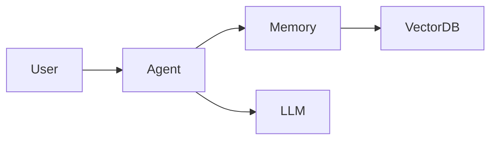

# 技术专栏 Agent 工作流（Technical Writing Agent Pipeline）

一个高质量 **技术专栏写作 Agent 工作流**，本质上是把「选题 → 调研 → 思考 → 写作 → 审核 → 发布 → 迭代」拆解成多个专业 Agent 协作。下面给出一个适合 AI / 大模型 / 编程 / 架构 / 前沿技术方向专栏的完整工作流。

---

## 总体架构

```
                  用户需求 / 热点 / 灵感
                        |
                        v
               ┌────────────────┐
               │  Topic Agent    │
               │ 选题策划 Agent   │
               └────────────────┘
                        |
                        v
               ┌────────────────┐
               │ Research Agent  │
               │ 文献调研 Agent   │
               └────────────────┘
                        |
                        v
               ┌────────────────┐
               │ Knowledge Agent │
               │ 知识体系构建     │
               └────────────────┘
                        |
                        v
               ┌────────────────┐
               │ Outline Agent   │
               │ 大纲设计 Agent   │
               └────────────────┘
                        |
                        v
               ┌────────────────┐
               │ Writing Agent   │
               │ 内容生成 Agent   │
               └────────────────┘
                        |
                        v
         ┌─────────────────────────┐
         │ Review / Critic Agent    │
         │ 技术审稿 + 逻辑审核       │
         └─────────────────────────┘
                        |
                        v
               ┌────────────────┐
               │ Editor Agent    │
               │ 编辑优化 Agent   │
               └────────────────┘
                        |
                        v
               ┌────────────────┐
               │ Publishing Agent│
               │ 发布运营 Agent   │
               └────────────────┘
                        |
                        v
               数据反馈 & 内容迭代
```

---

## 1. Topic Agent（选题策划 Agent）

### 目标

发现值得写的技术主题，并形成选题决策。

### 输入

- 技术领域
- 用户画像
- 专栏定位
- 当前热点

例如：

```
领域：
  - LLM
  - Agent
  - RAG
  - 多模态

目标读者：
  - AI工程师
  - 研究人员

平台：
  - 微信公众号
  - 知乎
  - 技术博客
```

### 工作内容

#### 趋势分析

收集：
- arxiv 热点
- GitHub Trending
- Hacker News
- 技术博客
- Conference 最新论文

#### 选题评分

建立评分模型：

| 指标 | 权重 |
| --- | ---: |
| 技术价值 | 30% |
| 热点程度 | 20% |
| 长期价值 | 20% |
| 读者需求 | 20% |
| 原创空间 | 10% |

输出：

```
Title: 《从RAG到Agent Memory：下一代知识增强系统》

Why:
  - Agent Memory 是2026热点
  - 国内中文资料不足
  - 适合系列文章
```

---

## 2. Research Agent（技术调研 Agent）

### 目标

成为该主题领域专家。

### 输入

选题：

```
Transformer KV Cache优化
```

### 调研流程

#### 第一层：基础知识

回答：
- 什么问题？
- 为什么出现？
- 解决什么痛点？

例如：

```
KV Cache解决：
  Transformer重复计算Attention Key/Value的问题
```

#### 第二层：技术演进

生成 Timeline：

```
2017 Transformer
     |
2020 GPT-3 KV Cache
     |
2023 PagedAttention
     |
2024 MLA
     |
2025 KV Compression
```

#### 第三层：论文分析

提取：
- 核心思想
- 方法
- 实验
- 局限

输出：

```
Paper: Attention Is All You Need
Contribution: 提出Transformer架构
Limitation: 计算复杂度O(n²)
```

#### 第四层：工程实践

分析：
- 开源项目
- 工业方案
- 实际代码

例如：

```
vLLM: PagedAttention
DeepSpeed: Inference Optimization
```

---

## 3. Knowledge Agent（知识体系 Agent）

### 目标

把碎片知识组织成体系。

输入：

```
20篇论文
30篇博客
10个项目
```

输出——知识地图：

```
                   Agent Memory
                        |
       --------------------------------
       |              |               |
 Short Memory   Long Memory     Working Memory
       |
       -----------------------------
       |             |              |
 Vector DB   Knowledge Graph   Cache
```

生成：
- 概念关系
- 技术路线
- 对比表

例如：

| 技术 | 优势 | 问题 |
| --- | --- | --- |
| RAG | 简单 | 幻觉 |
| Fine-tuning | 稳定 | 成本高 |
| Agent Memory | 动态 | 复杂 |

---

## 4. Outline Agent（大纲设计 Agent）

### 目标

设计文章结构。

典型技术文章结构：

```
标题
摘要
1. 背景
   为什么需要这个技术
2. 基础概念
   核心原理
3. 技术演进
   过去 -> 现在
4. 核心方法
   算法/架构
5. 工程实践
   Code + System
6. 案例分析
7. 当前挑战
8. 未来趋势
总结
```

同时生成：
- SEO 关键词
- 阅读路径
- 配图需求

---

## 5. Writing Agent（写作 Agent）

### 目标

生成初稿。

### 写作策略

#### 不直接生成全文

采用章节级生成：

```
Introduction
     |
     v
Section 1
     |
     v
Section 2
     |
     v
Conclusion
```

每章节：

```
输入：
  章节目标
  关键知识点
  参考资料

输出：
  1000-2000字
```

### 内容增强

自动加入：

#### 示例代码

例如：

```python
response = agent.run(
    query="Explain RAG"
)
```

#### 架构图

例如：

```
User
  |
Retriever
  |
Vector DB
  |
LLM
  |
Answer
```

#### 对比表

提升阅读体验。

---

## 6. Critic Agent（技术审稿 Agent）

这是最重要环节，类似论文 Reviewer。

### 技术正确性

问题：

```
Transformer是否真的O(n²)?
```

### 逻辑完整性

检查：

```
是否跳跃？
是否缺少背景？
```

### 深度评价

判断：

```
文章是否只是资料整理？
是否有作者观点？
```

输出 Review：

```
Score:
  Technical: 8/10
  Depth: 6/10
Suggestion:
  增加Agent Memory架构分析
```

---

## 7. Editor Agent（内容编辑 Agent）

### 目标

提升可读性。

### 标题优化

原：

```
RAG技术介绍
```

改：

```
为什么RAG正在被Agent取代？
从知识检索到智能记忆系统
```

### 开头增强

增加：
- 问题
- 场景
- 冲突

例如：

```
今天的大模型最大的问题不是不会回答，
而是不知道自己不知道。
```

### 语言调整

```
论文语言
    |
技术博客语言
```

---

## 8. Visual Agent（视觉 Agent）

负责：
- 封面
- 架构图
- 流程图
- Mermaid 图

生成：

```
文章: 《Agent Memory架构》
需要:
  1张封面
  2张系统架构图
  3张流程图
```

例如：



---

## 9. Publishing Agent（发布 Agent）

负责多平台适配，一次生成：

### 微信公众号

特点：
- 强标题
- 强开头
- 图文结合

### 知乎

特点：
- 深度
- 长回答

### GitHub

特点：
- README
- Code Example

### Twitter/X

生成 Thread：

```
1/
RAG is changing...

2/
Traditional RAG...
```

---

## 10. Feedback Agent（反馈迭代 Agent）

收集：
- 阅读量
- 点赞
- 收藏
- 评论
- 搜索排名

分析：

```
标题点击率低
    |
优化标题

阅读完成率低
    |
优化结构
```

---

## 完整 Multi-Agent 协议

可以抽象成：

```yaml
TechnicalWriterAgent:
  agents:
    - TopicAgent:
        role: discover topics
    - ResearchAgent:
        role: collect knowledge
    - KnowledgeAgent:
        role: build knowledge graph
    - OutlineAgent:
        role: design structure
    - WriterAgent:
        role: generate draft
    - CriticAgent:
        role: review accuracy
    - EditorAgent:
        role: improve readability
    - VisualAgent:
        role: generate diagrams
    - PublisherAgent:
        role: distribute content
    - FeedbackAgent:
        role: optimize next articles
```

---

## 推荐升级版：AI 技术专栏「研究型 Agent」

如果目标是写 **LLM / Agent / 多模态 / 知识图谱方向的高质量专栏**，建议增加：

```
Researcher Agent
       |
       |
Literature Graph Agent
       |
       |
Experiment Agent
       |
       |
Engineering Agent
       |
       |
Writer Agent
```

形成类似：

> 一个 AI 研究员 + 技术作者 + 编辑团队的虚拟工作流。

最终产物不是普通博客，而是：
- 技术综述
- 系列教程
- 架构解析
- 开源项目分析
- 前沿趋势报告

这套流程可以直接实现成一个 **LangGraph / CrewAI / AutoGen 技术写作 Agent 系统**。